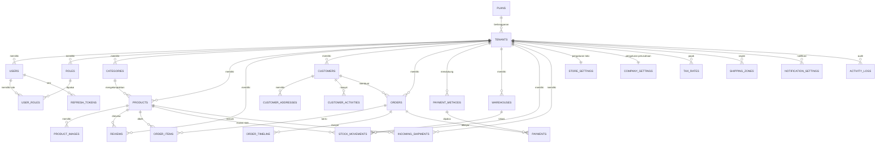

# ERD — SaaS Ecommerce (LAKU)

Multi-tenant SaaS ecommerce: platform (`tenants`) menghosting banyak toko.
Semua tabel domain membawa `tenant_id` (FK → `tenants`, ON DELETE CASCADE) dan
selalu difilter `WHERE tenant_id = ?` di layer repository.



## Tabel

| Tabel | Catatan |
|---|---|
| `plans` | Paket SaaS: free / pro / business |
| `tenants` | Toko/platform customer; `subscription_status` (trial/active/past_due/cancelled) |
| `users` | `tenant_id` NULL = platform admin; password bcrypt |
| `roles` / `user_roles` | RBAC; `permissions` bitmask (1=products 2=orders 4=customers 8=inventory 16=settings 32=users 64=analytics 128=reviews 256=payments) |
| `refresh_tokens` | Refresh token rotasi (hash, expiry, revoked_at) |
| `categories` | Tree (`parent_id`), slug unik per tenant |
| `products` | SKU unik per tenant; stok tersedia/reserved/incoming; rating di-cache |
| `product_images` | URL (MinIO), `is_primary` |
| `reviews` | Rating 1–5; publish/moderation memperbarui `products.rating` |
| `customers` | Statistik kumulatif di-cache (total_orders, total_spent, aov, last_order_at) |
| `customer_addresses` | Alamat kirim |
| `customer_activities` | Timeline customer (order/login/review/support/payment) |
| `orders` | Snapshot `shipping_address` (JSONB); status: pending→confirmed→processing→shipped→delivered / cancelled / refunded |
| `order_items` | Snapshot nama/SKU/gambar produk |
| `order_timeline` | Event order (created/confirmed/shipped/.../payment/note/refunded) |
| `payments` | Transaksi payment provider; `provider_transaction_id` |
| `payment_methods` | Konfigurasi metode (card/bank_transfer/cod/e_wallet) |
| `warehouses` | Lokasi penyimpanan |
| `stock_movements` | Mutasi stok (in/out/adjustment/return) |
| `incoming_shipments` | Restock terjadwal; status delivered → stok masuk |
| `store_settings` / `company_settings` | 1 baris per tenant |
| `tax_rates`, `shipping_zones`, `notification_settings` | Konfigurasi toko |
| `activity_logs` | Audit global (tambahan `tenant_id`) |

## Alur stok

```
order dibuat   : stock -= qty, reserved += qty
order dikirim  : reserved -= qty
order batal    : reserved -= qty, stock += qty
shipment sampai: stock += qty (incoming -= qty), + movement "in"
stock opname   : movement adjustment (± qty)
```

## Alur pembayaran (mock)

```
POST /orders  → payment_status=pending
POST /payments/charge → Payment row + mock redirect URL
POST /payments/webhook {transaction_id, status} → payment & order payment_status
```
